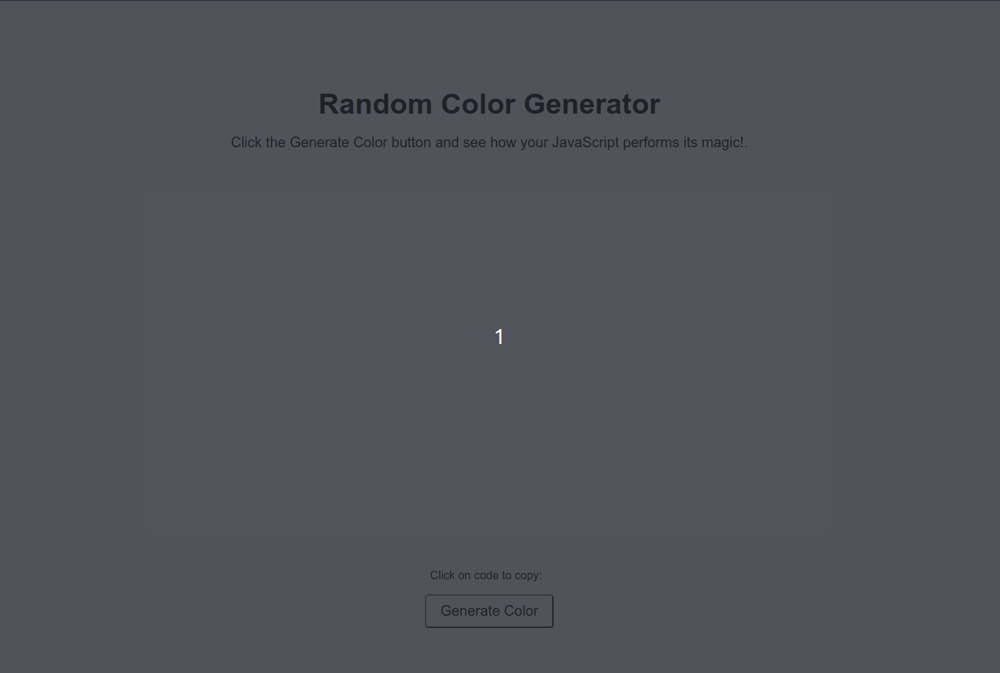

# Color Picker DOM Widget

## Description

A simple color palette generator that generates a color palette based on the color you choose. The user can effortlessly generate random colors and copy their hexadecimal codes to the clipboard.

This project provides an interactive and easy way for users to generate and copy random colors for their needs, making use of various JavaScript techniques to deliver a seamless experience.

## Features

1. **Random Color Generation:** At the click of a button, a random color is generated and displayed on the screen.
2. **Copy to Clipboard:** The generated color's hexadecimal code can be easily copied to the clipboard by clicking on it.
3. **Interactive Feedback:** The button has a hover effect, providing a more engaging user experience.

## JavaScript Techniques

1. **DOM Manipulation:** The JavaScript code uses `document.getElementById()` to select and manipulate various elements on the page, such as changing the background color of a div or updating the text content of a span.
2. **Event Listeners:** The script utilizes event listeners to respond to user interactions. For example, when the button is clicked, a color is generated, and when the color code is clicked, it's copied to the clipboard.
3. **Random Color Generation Algorithm:** The script includes a function that generates random hexadecimal color codes by looping through a string of characters and appending them to a base string.
4. **Clipboard API:** The `navigator.clipboard.writeText()` method is used to copy the generated color code to the user's clipboard.
5. **Strict Mode:** The script operates in strict mode (`"use strict";`), ensuring that the code adheres to a stricter set of rules, reducing potential errors and issues.

## The JavaScript functionality includes:

1. **DOM Selection:** The script begins by selecting three elements:

   - `colorDisplay`: The `div` where the generated color will be displayed.
   - `btnGenerate`: The button which, when clicked, will trigger the color generation.
   - `currentColorCode`: The `span` that displays the color code and allows the user to copy it.

2. **Random Color Generation:** The function `generateRandomColor()` produces a random hexadecimal color code. This is achieved by looping 6 times (for each character in the hexadecimal color code, excluding the `#`) and appending a random character from the string `letters`.

3. **Event Listeners:**

   - There's an event listener on the `btnGenerate` button. When this button is clicked, a random color is generated using the `generateRandomColor()` function. This color is then applied as the background color for the `colorDisplay` div, and the color code is shown in the `currentColorCode` span.
   - There's another event listener on the `currentColorCode` span. When this span is clicked, the color code displayed is copied to the user's clipboard using the `navigator.clipboard.writeText()` method, and an alert is shown to notify the user.
